# 配置说明

本文档将尽可能解释 `OptiScaler.ini` 和游戏内菜单（打开菜单的快捷键为 **INSERT**）的各项设置。

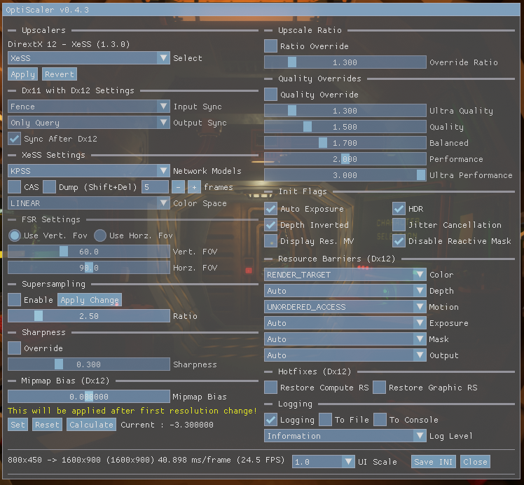

### 超分辨率技术（Upscalers）
OptiScaler 支持 DirectX 11、DirectX 12 和 Vulkan 三种 API，并支持多种超分辨率后端。你可以在 `OptiScaler.ini` 文件的 `[Upscalers]` 部分选择使用哪个超分辨率技术。

```ini
[Upscalers]
; 为 Dx11 游戏选择超分辨率技术
; fsr22 (原生 dx11), xess (需要 dx12), fsr21_12 (dx11 通过 dx12) 或 fsr22_12 (dx11 通过 dx12)
; 默认 (auto) 为 fsr22
Dx11Upscaler=auto

; 为 Dx12 游戏选择超分辨率技术
; xess, fsr21 或 fsr22
; 默认 (auto) 为 xess
Dx12Upscaler=auto

; 为 Vulkan 游戏选择超分辨率技术
; fsr21 或 fsr22
; 默认 (auto) 为 fsr21
VulkanUpscaler=auto
```

* `fsr21` 表示 FSR 2.1.2
* `fsr22` 表示 FSR 2.2.1
* `xess` 表示 XeSS

*对于 DirectX11 的 `fsr21_12`、`fsr22_12` 和 `xess`，会使用一个 DirectX12 后台设备来使用仅限 DirectX12 的超分辨率技术。此方法有 10-15% 的性能损失，但提供了更多超分辨率选项。此外，FSR 2.2.1 的原生 DirectX11 实现是从 Unity 渲染器移植而来，有其自身的问题，其中部分问题已被 OptiScaler 规避。*

也可以使用游戏内菜单的 `Upscalers` 部分来选择超分辨率技术。

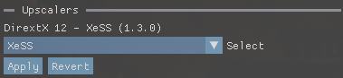

### 伪超采样（Pseudo SuperSampling）
从 OptiScaler 0.4 开始，`[Upscalers]` 下新增了伪超采样选项。

```ini
[Upscalers]
; 为 Dx12 和通过 Dx12 后端的 Dx11 启用伪超采样选项
; true 或 false - 默认 (auto) 为 false
SuperSamplingEnabled=auto

; 伪超采样比例
; 0.0 - 5.0 - 默认 (auto) 为 2.5
SuperSamplingMultiplier=auto
```

简单解释一下：例如，当你的游戏以 1080p 运行并选择 DLSS `Quality` 预设时，它会渲染 720p 的图像，连同其他必要的输入信息一起发送给超分辨率技术，然后生成 1080p 的图像作为输出。

如果启用伪超采样，它会使用 `SuperSamplingMultiplier` 来计算超分辨率技术的目标渲染尺寸。以 720p 和默认倍率（2.5）为例，目标尺寸为 1800p。此时超分辨率技术会将图像放大到 1800p 而不是 1080p，然后 OptiScaler 会将输出图像缩小回 1080p。

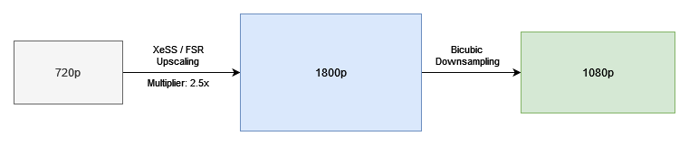

由于放大目标分辨率更高，与直接放大相比会有性能损失。但主观上，它可以以更高的性能水平产生接近 DLAA 质量的图像。

可以通过游戏内菜单实时更改。

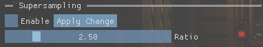

### Dx11 配合 Dx12 的同步设置
对于 DirectX11 的 `fsr21_12`、`fsr22_12` 和 `xess` 选项，OptiScaler 使用 DirectX12 后台设备来使用这些仅限 DirectX12 的超分辨率技术。这是一个非常小众的功能，可能在与不稳定的 GPU 驱动（尤其是 Intel）配合时出现问题。为减轻并防止崩溃或图形问题，可以使用此选项。

```ini
[Dx11withDx12]
; Dx11 与 Dx12 的同步方法
;
; 有效值：
;	0 - 不进行同步                                  (最快，但最易出错)
;	1 - Fence
;	2 - Fences + Flush
;	3 - Fences + Event
;	4 - Fences + Flush + Event
;	5 - 仅 Query

; 默认 (auto) 为 1
TextureSyncMethod=auto

; 默认 (auto) 为 5
CopyBackSyncMethod=auto

; 在 Dx12 执行之前或之后开始输出回拷同步
; true 或 false - 默认 (auto) 为 true
SyncAfterDx12=auto

; 延迟 D11wDx12 功能创建期间的某些操作以提高兼容性
; true 或 false - 默认 (auto) 为 false
UseDelayedInit=auto
```
下图显示了 Dx11 配合 Dx12 超分辨率处理流程。黄色圆圈是同步点（或可能的同步点）。`SyncAfterDx12` 选择第二次同步发生的时间。

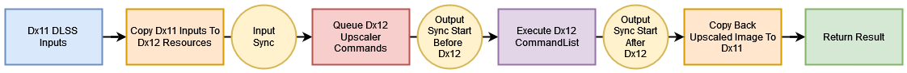

`No syncing`（不进行同步）：顾名思义
`Fence`：使用共享的 `Fence`（Signal & Wait）同步。这些应在 GPU 上完成，速度相当快。
`Fence + Event`：使用共享的 `Fence`（Signal & Event）同步。`Event` 在 CPU 上等待，速度较慢。
`Flush`：在 Signal 共享 `Fence` 后，`Flush` Dx11 的 DeviceContext。
`Query Only`：使用 Dx11 `Query` 同步，通常比 `Event` 快，但比 `Fence` 慢。

当使用 `Event` 同步输出时，`SyncAfterDx12=false` 通常性能更好。

**这些设置因游戏和硬件而异。默认值是为均衡性能和稳定图像而设置的，追求高性能的用户可能需要针对每个游戏进行调整。**

这些可以通过游戏内菜单实时更改（`UseDelayedInit` 除外）。

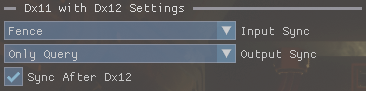

### XeSS 设置

```ini
[XeSS]
; 在初始化前构建 XeSS pipeline
; true 或 false - 默认 (auto) 为 true
BuildPipelines=auto

; 选择 XeSS 网络模型
; 0 = KPSS
; 1 = Splat
; 2 = Model 3
; 3 = Model 4
; 4 = Model 5
; 5 = Model 6
;
; 默认 (auto) 为 0
NetworkModel=auto

[CAS]
; 为 XeSS 启用 CAS 锐化
; true 或 false - 默认 (auto) 为 false
Enabled=auto

; 输入和输出的色彩空间转换
; 可选值见文件末尾 - 默认 (auto) 为 0
ColorSpaceConversion=auto
```

`BuildPipelines` 参数允许在上下文创建期间构建 XeSS pipeline，以防止后续卡顿。

`NetworkModel` 用于选择 XeSS 超分辨率使用的网络模型。**（目前对超分辨率后的图像没有可见影响）**

#### CAS
通常 XeSS 相比其他超分辨率技术会产生更柔和的最终图像，并且没有锐化选项来弥补。因此 OptiScaler 允许你在最终图像上使用 AMD 的 CAS 锐化滤镜，以平衡超分辨率图像的柔和感。不过 CAS 并不完美，在某些游戏上会导致一些伪影/问题，如辉光效果消失、图像色调偏移或直接黑屏无图像。

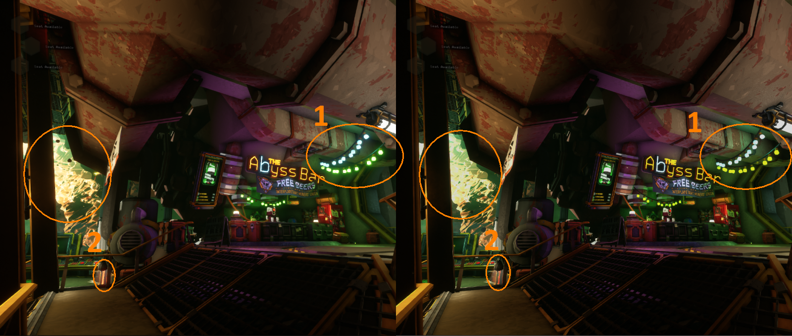

1. 辉光被移除
2. 色调被改变

`ColorSpaceConversion` 用于修复色彩空间转换问题，但**几乎总是**使用默认设置即可正常工作。

可以通过游戏内菜单实时更改。

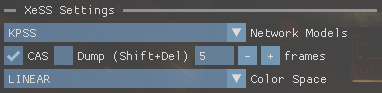

`Dump` 选项用于调试目的，会将 XeSS 的输入输出参数和纹理转储到游戏目录。

### FSR 设置

```ini
[FSR]
; 0.0 到 180.0 - 默认 (auto) 为 60.0
VerticalFov=auto

; 如果未定义垂直 FOV，将用于计算垂直 FOV
; 0.0 到 180.0 - 默认 (auto) 为 off
HorizontalFov=auto
```

为改善图像质量，你可以尝试用这些设置匹配游戏的垂直或水平 FOV。默认是 60° 垂直 FOV，大多数情况下都能正常工作。

可以通过游戏内菜单实时更改。

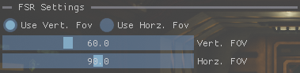

### 锐化（Sharpness）
DLSS 曾经有锐化选项，但后来被移除了。因此有些游戏有锐化滑块，有些没有。使用此选项可以禁用或启用最终图像的锐化。FSR 内置锐化，但 XeSS 必须启用 CAS 选项。

```ini
[Sharpness]
; 用固定锐化值覆盖 DLSS 锐化参数
; true 或 false - 默认 (auto) 为 false
OverrideSharpness=auto

; 锐化强度
; 值范围 0.0 到 1.0 - 默认 (auto) 为 0.3
Sharpness=auto
```

可以通过游戏内菜单实时更改。

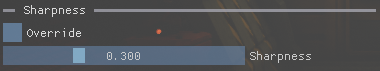

### 缩放比例（Upscaling Ratios）
OptiScaler 提供多个覆盖和锁定缩放比例的选项。

#### 缩放比例覆盖（Upscale Ratio Override）
`UpscaleRatioOverride` 允许你为所有质量预设选择一个统一的缩放比例。

```ini
[UpscaleRatio]
; 设为 true 以启用内部分辨率覆盖
; true 或 false - 默认 (auto) 为 false
UpscaleRatioOverrideEnabled=auto

; 设为 true 以启用将 DRS 最大分辨率限制为覆盖后的比例
; true 或 false - 默认 (auto) 为 false
DrsMaxOverrideEnabled=auto

; 设置强制缩放比例值
; 默认 (auto) 为 1.3
UpscaleRatioOverrideValue=auto
```

可以在游戏内菜单中更改并保存，但通常更改会在重启或分辨率改变后生效。

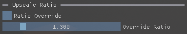

#### 质量预设比例覆盖（Quality Ratio Override）
`QualityRatioOverride` 允许你为每个质量预设覆盖缩放比例。

```ini
[QualityOverrides]
; 设为 true 以启用自定义质量模式覆盖
; true 或 false - 默认 (auto) 为 false
QualityRatioOverrideEnabled=auto

; 为每个质量模式设置自定义缩放比例
;
; 默认 (auto) 值：
; Ultra Quality         : 1.3
; Quality               : 1.5
; Balanced              : 1.7
; Performance           : 2.0
; Ultra Performance     : 3.0
QualityRatioUltraQuality=auto
QualityRatioQuality=auto
QualityRatioBalanced=auto
QualityRatioPerformance=auto
QualityRatioUltraPerformance=auto
```

**如果两个覆盖都启用，`UpscaleRatioOverride` 优先于 `QualityRatioOverride`**

当 `DrsMaxOverrideEnabled` 启用时，对于支持 DRS 的游戏，它会将最大内部渲染分辨率限制为默认渲染分辨率（而不是显示分辨率）。启用后，它实际上禁用了 DRS。适用于 `QualityRatioOverride` 和 `UpscaleRatioOverride`。

可以在游戏内菜单中更改并保存，但通常更改会在重启或分辨率改变后生效。

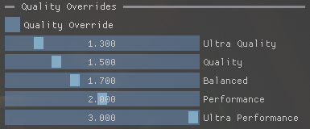

### 初始化标志（Init Flags）
这些设置允许你覆盖 DLSS 初始化标志以修复某些问题。

```ini
[Depth]
; 强制向初始化标志添加 INVERTED_DEPTH
; true 或 false - 默认 (auto) 为 DLSS 默认值
DepthInverted=auto

[Color]
; 强制向初始化标志添加 ENABLE_AUTOEXPOSURE
; 部分 Unreal Engine 游戏需要此项，可修复颜色问题，尤其是在黑暗区域
; true 或 false - 默认 (auto) 为 DLSS 默认值
AutoExposure=auto

; 强制向初始化标志添加 HDR_INPUT_COLOR
; true 或 false - 默认 (auto) 为 DLSS 默认值
HDR=auto

[MotionVectors]
; 强制向初始化标志添加 JITTERED_MV
; true 或 false - 默认 (auto) 为 DLSS 默认值
JitterCancellation=auto

; 强制向初始化标志添加 HIGH_RES_MV
; true 或 false - 默认 (auto) 为 DLSS 默认值
DisplayResolution=auto

[Hotfix]
; 强制从初始化标志中移除 RESPONSIVE_PIXEL_MASK
; true 或 false - 默认 (auto) 为 true
DisableReactiveMask=auto
```

启用 `AutoExposure` 有助于修正黑暗或褪色的问题。


有报告称启用 `HDR` 有助于修复某些游戏中的紫色色调问题。

启用 `DisableReactiveMask` 可以在某些游戏中帮助 FSR 后端，但通常它带来的问题比解决的更多。这就是为什么默认禁用。

某些游戏可能错误地设置运动矢量大小标志，导致镜头移动时出现过度运动模糊。在这些情况下，启用或禁用 `DisplayResolution` 可能会有所帮助。


这些可以通过游戏内菜单实时更改。

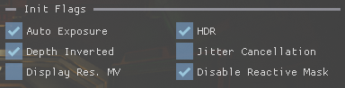

### 资源屏障（Resource Barriers，仅限 Dx12）
某些游戏（尤其是 Unreal Engine）会以错误状态向 DLSS 发送输入资源，导致图形问题（尤其是在 AMD 硬件上）。通常 OptiScaler 会尝试检测引擎类型并减轻这些问题，但有时游戏不能正确报告此信息。为修复问题，以下 ini 参数会有所帮助。

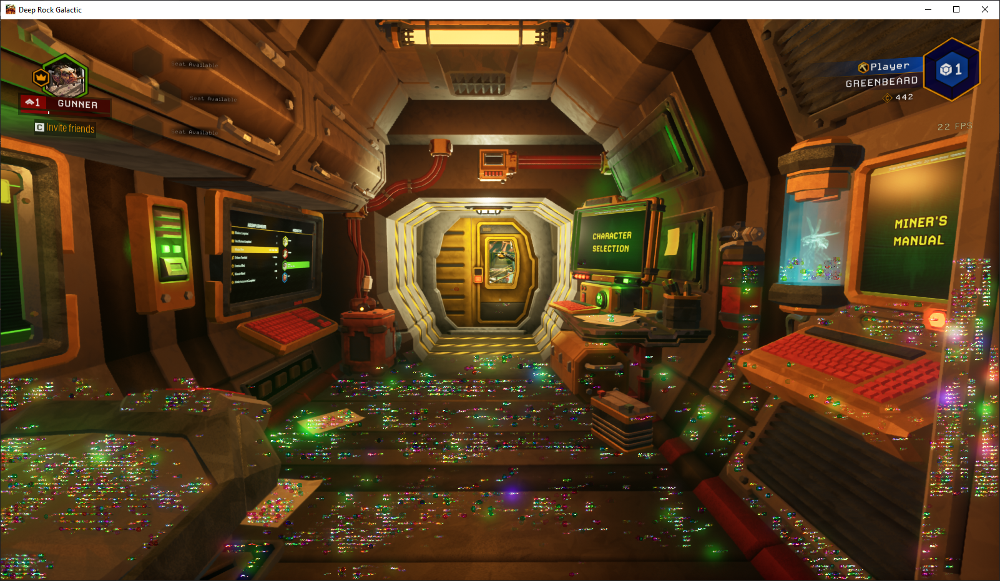

**在此处设置错误的资源状态可能导致崩溃！**

```ini
[Hotfix]
; 颜色纹理资源状态修正，修复 AMD 显卡上的彩虹色问题（主要针对 UE 游戏）
; 对于 UE 引擎游戏和 AMD 显卡，设置为 D3D12_RESOURCE_STATE_RENDER_TARGET (4)
; 默认 (auto) 为不进行状态修正
ColorResourceBarrier=auto

; 运动矢量纹理资源状态，修正为 D3D12_RESOURCE_STATE_NON_PIXEL_SHADER_RESOURCE（主要用于调试）
; 默认 (auto) 为不进行状态修正
MotionVectorResourceBarrier=auto

; 深度纹理资源状态，修正为 D3D12_RESOURCE_STATE_NON_PIXEL_SHADER_RESOURCE（主要用于调试）
; 默认 (auto) 为不进行状态修正
DepthResourceBarrier=auto

; 颜色遮罩纹理资源状态，修正为 D3D12_RESOURCE_STATE_NON_PIXEL_SHADER_RESOURCE（主要用于调试）
; 默认 (auto) 为不进行状态修正
ColorMaskResourceBarrier=auto

; 曝光纹理资源状态，修正为 D3D12_RESOURCE_STATE_NON_PIXEL_SHADER_RESOURCE（主要用于调试）
; 默认 (auto) 为不进行状态修正
ExposureResourceBarrier=auto

; 输出纹理资源状态，修正为 D3D12_RESOURCE_STATE_UNORDERED_ACCESS（主要用于调试）
; 默认 (auto) 为不进行状态修正
OutputResourceBarrier=auto
```

这些可以通过游戏内菜单实时更改。

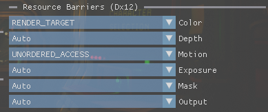

### Mipmap LOD 偏移覆盖（Mipmap LOD Bias Override，仅限 Dx12）
为了获得更好的纹理清晰度，可以用此设置覆盖 `MipmapLodBias`。-15 最锐利，+15 最模糊。

```ini
[Hotfix]
; 覆盖纹理的 mipmap lod bias
; -15.0 - 15.0 - 默认 (auto) 为禁用
MipmapBiasOverride=auto
```

**调整 MipmapLODBias 会影响性能！**

可以通过游戏内菜单更改，需要更改分辨率才能生效。

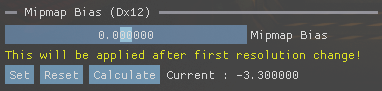

### 恢复根签名（Restore Root Certificates，仅限 Dx12）
此热修复基于原始 CyberFSR2 的恢复 ComputeRootSignature 逻辑，我还添加了恢复 ComputeRootSignature 的选项。我尚未注意到有游戏需要这些选项。

```ini
[Hotfix]
; 超分辨率后在恢复上一次使用的计算签名
; true 或 false - 默认 (auto) 为 false
RestoreComputeSignature=auto

; 超分辨率后恢复上一次使用的图形签名
; true 或 false - 默认 (auto) 为 false
RestoreGraphicSignature=auto
```

这些可以通过游戏内菜单实时更改。

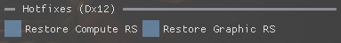

### 日志（Logging）
```ini
[Log]
; 启用日志
; true 或 false - 默认 (auto) 为 true
LoggingEnabled=auto

; 日志文件，如果未定义则为当前文件夹中的 log_xess_xxxx.log
;LogFile=./CyberXess.log

; 文件日志的详细级别
; 0 = Trace / 1 = Debug / 2 = Info / 3 = Warning / 4 = Error
; 默认 (auto) 为 2 = Info
LogLevel=auto

; 输出日志到控制台（出于性能原因，日志级别始终为 2 (Info)）
; true 或 false - 默认 (auto) 为 false
LogToConsole=auto

; 输出日志到文件
; true 或 false - 默认 (auto) 为 false
LogToFile=auto

; 输出日志到 NVNGX API
; true 或 false - 默认 (auto) 为 false
LogToNGX=auto

; 打开用于查看日志的控制台窗口
; true 或 false - 默认 (auto) 为 false
OpenConsole=auto
```

这些可以通过游戏内菜单实时更改。

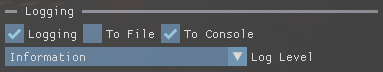

### 菜单（Menu）
```ini
[Menu]
; 游戏内 ImGui 菜单缩放
; 1.0 到 2.0 - 默认 (auto) 为 1.0
Scale=auto
```

这些可以通过游戏内菜单实时更改。

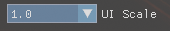
